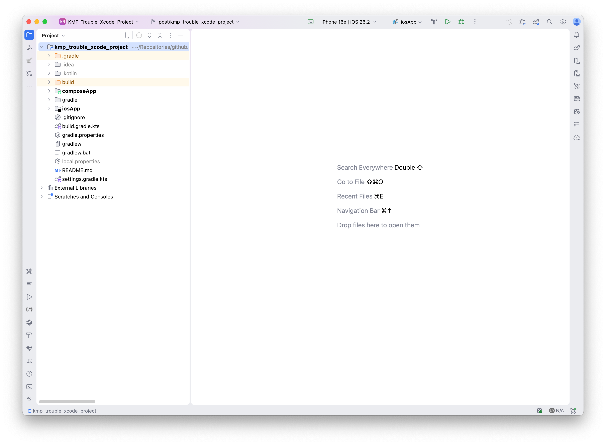
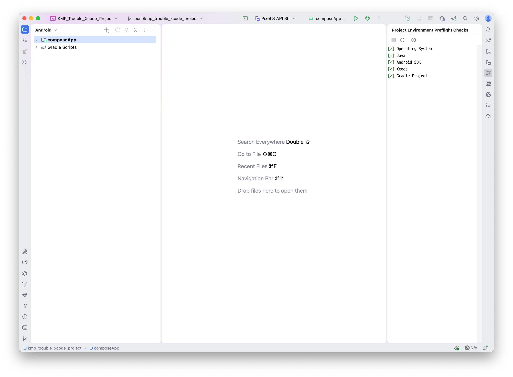

# KMP 프로젝트의 Xcode 프로젝트 문제

KMP 프로젝트에서 Xcode 프로젝트 파일 때문에 생기는 문제와 해결 방법을 다루는 샘플 프로젝트.

## [프로젝트 구조][1]

프로젝트를 생성하면 다음과 같은 뷰를 사용할 수 있다.

| Project 탭                                             | Android 탭                                             |
|-------------------------------------------------------|-------------------------------------------------------|
|  |  |

## 참고

1. [Project tool window | IntelliJ IDEA Documentation][1]

[1]: https://www.jetbrains.com/help/idea/project-tool-window.html